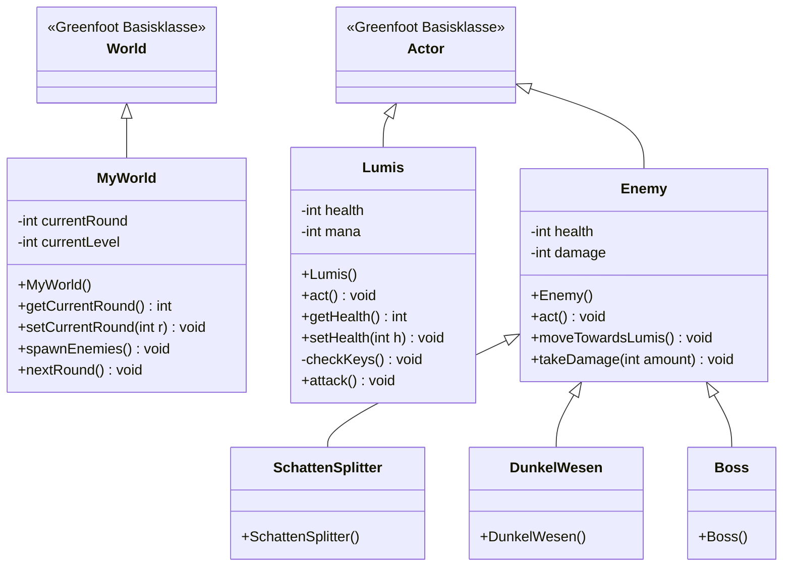

# OOA & OOD: Shadow Purge

Diese Dokumentation enthält die Objektorientierte Analyse (OOA) und das Objektorientierte Design (OOD) für das Greenfoot-Projekt "Shadow Purge", basierend auf den im Unterricht (LF8) verwendeten Standards.

---

## 1. Objektorientierte Analyse (OOA)

In der Analysephase werden die fachlichen Anforderungen ohne technische Details (wie Java-Datentypen) modelliert. Fokus liegt auf den Klassen, ihren Attributen und ihren Beziehungen (Multiplizitäten).

### Klassen und Attribute
*   **Lumis**: name, lebenspunkte, mana, position
*   **Gegner**: typ, lebenspunkte, schaden
*   **Licht-Partikel**: wert
*   **Welt**: levelName, rundenAnzahl

### Beziehungen (Multiplizitäten)
*   **1 Welt -- 1 Lumis**: Die Welt enthält genau einen Spielercharakter.
*   **1 Welt -- 0..* Gegner**: In der Welt können beliebig viele (oder keine) Gegner existieren.
*   **1 Welt -- 0..* Licht-Partikel**: In der Welt können Ressourcen zum Einsammeln verteilt sein.

---

## 2. Objektorientiertes Design (OOD)

Das Design zeigt die technische Umsetzung in Greenfoot/Java. Hier werden Sichtbarkeiten (`+` / `-`), Datentypen, Konstruktoren sowie Getter- und Setter-Methoden definiert.

### Klassendiagramm (UML)

### Design-Entscheidungen
*   **Vererbung**: Alle Gegnertypen erben von der Basisklasse `Enemy`. Gemeinsame Logik (wie `moveTowardsLumis`) wird dort einmalig implementiert.
*   **Kapselung**: Alle Attribute sind `private` (`-`). Der Zugriff erfolgt sicher über `public` (`+`) Getter- und Setter-Methoden.
*   **Greenfoot-Integration**: Die Klassen `Lumis` und `Enemy` nutzen die `act()`-Methode von Greenfoot zur Steuerung des Spielverhaltens.
