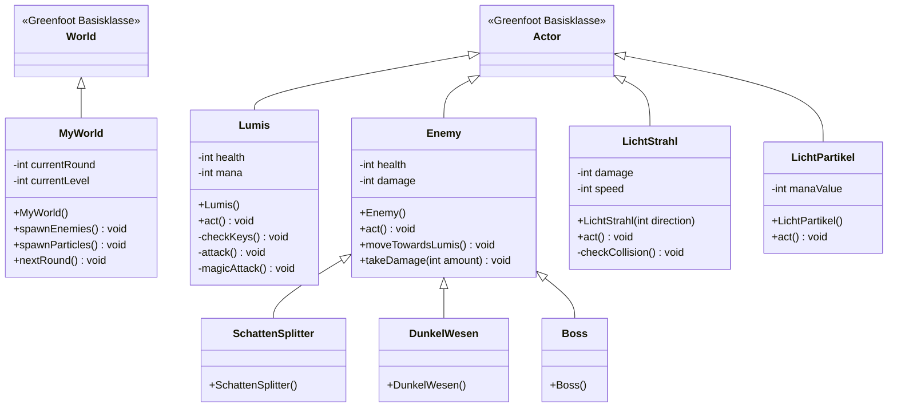

# OOA & OOD: Shadow Purge (Version 2)

> [!NOTE]
> Diese Version (v2) ergänzt das ursprüngliche Design um fehlende funktionale Anforderungen aus dem Lastenheft, insbesondere das Magie-System und die Ressourcen-Sammelmechanik.

---

## 1. Objektorientierte Analyse (OOA) - Erweitert

### Zusätzliche Klassen und Attribute
*   **Lumis**: + `mana` (Ressource für Fernkampf)
*   **Licht-Strahl**: `schaden`, `geschwindigkeit`, `richtung` (Projektil)
*   **Licht-Partikel**: `wert` (Ressource zum Auffüllen von Mana)

### Erweiterte Beziehungen
*   **1 Lumis -- 0..* Licht-Strahl**: Lumis erzeugt Projektile beim Fernkampf.
*   **1 Welt -- 0..* Licht-Partikel**: Die Welt generiert Ressourcen für den Spieler.

---

## 2. Objektorientiertes Design (OOD) - Erweitert

### Klassendiagramm (UML v2)

### Design-Änderungen in v2
*   **Fernkampf-Logik**: Die Klasse `LichtStrahl` wurde als eigenständiger `Actor` hinzugefügt, um die Projektil-Physik zu kapseln.
*   **Ressourcen-System**: `LichtPartikel` dient als Trigger-Objekt in der Welt, um das `mana`-Attribut von `Lumis` zu erhöhen.
*   **Input Handling**: In `Lumis` wurde `magicAttack()` ergänzt, welche die Taste 'E' prüft und neue `LichtStrahl`-Instanzen in der `MyWorld` erzeugt.
