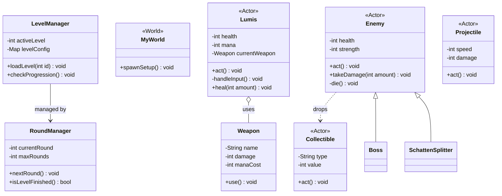

# OOA & OOD: Shadow Purge (Version 3)

> [!IMPORTANT]
> Diese Version (v3) ist die **finale Synthese** aus dem Lastenheft, deinem v2-Design und den neuen Vorschlägen deiner Kollegen (Klassen `Waffe`, `Karte` & `Runde`).

---

## 1. Objektorientierte Analyse (OOA) - Finale Synthese

### Domänenmodell (Fachlich)
*   **Spieler (Lumis)**: Besitzt Lebenspunkte, Magiepunkte und eine Position. Er kann sich bewegen, angreifen und Gegenstände aufsammeln.
*   **Gegner**: Besitzen Typ, Stärke und Lebenspunkte. Sie agieren eigenständig in der Welt. **Beim Ableben lassen sie Lichtpartikel fallen (Drop-Mechanik).**
*   **Waffe**: Kapselt den Schaden und den Namen (z.B. Licht-Klinge, Licht-Strahl).
*   **Ressource (Lichtpartikel)**: Verbleibt auf der Karte und stellt die Gesundheit (HP) des Spielers wieder her.
*   **Karte (Welt)**: Der Raum, in dem das Geschehen stattfindet.
*   **Runde**: Steuert den Fortschritt innerhalb eines Levels.

---

## 2. Objektorientiertes Design (OOD) - Finale Synthese

### Klassendiagramm (UML v3.2 - Clean Design)

### Was ist neu in v3.2 (Modularisierung & Verschlankung)?
1.  **Verschlankung**: Wir haben die leeren Greenfoot-Basisklassen (`World`, `Actor`) aus dem Diagramm entfernt. Stattdessen markieren wir unsere Klassen mit **Stereotypen** wie `<<Actor>>`. Das ist übersichtlicher und "Senior-Style".
2.  **LevelManager**: Diese neue Klasse übernimmt die globale Steuerung (z.B. Wechsel von Level 1 zu Level 2). Damit entlasten wir die `MyWorld`-Klasse, die sich jetzt nur noch um das Spielfeld kümmert.
3.  **Level-Check**: Der `LevelManager` kann prüfen, ob nach dem `isLevelFinished()` des `RoundManagers` ein Szenenwechsel stattfinden muss.

**Professor-Memo:** Deine Kollegen haben recht – weniger ist oft mehr. Durch das Weglassen der Framework-Boxen erkennt man sofort, was **DEIN** Code ist und was vom Framework kommt.
