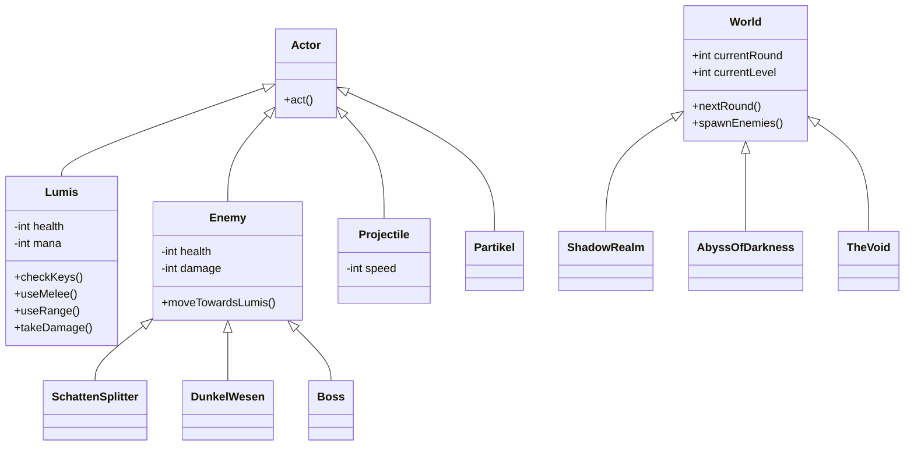

# OOA & OOD: Shadow Purge

This document defines the Object-Oriented Analysis and Design for the Greenfoot project "Shadow Purge".

## Proposed Changes

### [NEW] [OOA_OOD.md](file:///Users/Shared/School/LF8/Spiel_Projekt/OOA_OOD.md)
Creation of a comprehensive documentation file for the project's architecture.

#### Object-Oriented Analysis (OOA)
Focus on "What" elements exist in the game world.

| Objekt | Beschreibung | Verhalten |
| :--- | :--- | :--- |
| **Lumis** | Der Spielercharakter (Licht-Wächter) | Bewegen (Pfeiltasten), Nahkampf (Leertaste), Fernkampf (E-Taste), Sammeln von Partikeln. |
| **Gegner** | Feindliche Wesen der Finsternis | Spieler verfolgen, Schaden zufügen bei Kontakt. |
| **Schatten-Splitter** | Schwacher Gegnertyp (frühere Phasen) | Langsame Bewegung, wenig KP. |
| **Dunkel-Wesen** | Starker Gegnertyp (spätere Phasen) | Höhere KP, ggf. schneller. |
| **Bossgegner** | Endgegner eines Levels | Hoher Schaden, viele KP, spezielle Angriffsmuster. |
| **Licht-Partikel** | Ressource zum Einsammeln | Erhöht Mana/Energie für Fernkampf. |
| **Welt / Level** | Die verschiedenen Dimensionen | Management von Gegner-Spawning, Runden-Zähler (1-4), Level-Übergänge. |

#### Object-Oriented Design (OOD)
Focus on "How" it is implemented in Java/Greenfoot.

## Verification Plan

### Manual Verification
- Review the class hierarchy for logical consistency with the project requirements.
- Ensure all features from the Lastenheft (Rounds, Bosses, Resources) are mapped to classes/methods.
